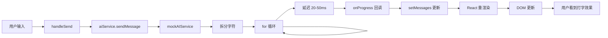

# AI 打字效果技术实现详解

## 🎯 实现原理概述

AI 回复的打字效果（Typing Effect）通过**流式响应（Streaming Response）**实现，核心思路是：
1. 将完整回答拆分成小块（字符或单词）
2. 逐步传递给前端组件
3. 实时更新 UI 显示

## 🏗️ 技术架构

```
用户输入 → AI Service → 流式回调 → 组件状态更新 → UI 打字效果
```

---

## 📝 实现方式一：Mock AI Service（本地模拟）

### 1. 核心实现代码

文件位置：`src/services/mockAIService.ts`

```typescript
/**
 * Simulate typing delay
 */
private async delay(ms: number): Promise<void> {
  return new Promise((resolve) => setTimeout(resolve, ms));
}

/**
 * Send mock message with streaming effect
 */
async sendMessage(
  messages: ChatMessage[],
  onProgress?: (text: string) => void  // 👈 关键：回调函数
): Promise<string> {
  // 获取回答内容
  const response = this.getRandomResponse(category);

  // 如果提供了回调函数，执行流式响应
  if (onProgress) {
    let currentText = '';
    const words = response.split('');  // 👈 拆分成单个字符

    // 逐字符输出
    for (let i = 0; i < words.length; i++) {
      currentText += words[i];  // 累加字符
      onProgress(currentText);   // 👈 回调传递当前文本

      // 随机延迟 20-50ms 模拟打字速度
      const delayTime = Math.random() * 30 + 20;
      await this.delay(delayTime);  // 👈 关键：异步延迟
    }

    return response;
  }

  // 无流式响应时直接返回
  await this.delay(500 + Math.random() * 500);
  return response;
}
```

### 2. 关键技术点

#### ✅ 字符拆分
```typescript
const words = response.split('');
// "你好世界" → ["你", "好", "世", "界"]
```

#### ✅ 累加输出
```typescript
let currentText = '';  // 累加器
for (let i = 0; i < words.length; i++) {
  currentText += words[i];  // 逐步累加
  onProgress(currentText);   // 每次传递完整文本
}
```

#### ✅ 异步延迟
```typescript
// 随机延迟模拟真实打字速度
const delayTime = Math.random() * 30 + 20;  // 20-50ms
await this.delay(delayTime);
```

---

## 📝 实现方式二：真实 OpenAI API（服务端流式）

### 1. 核心实现代码

文件位置：`src/services/aiService.ts`

```typescript
async sendMessage(
  messages: ChatMessage[],
  onProgress?: (text: string) => void
): Promise<string> {
  // 发送请求，开启 stream 模式
  const response = await fetch('https://api.openai.com/v1/chat/completions', {
    method: 'POST',
    headers: {
      'Content-Type': 'application/json',
      'Authorization': `Bearer ${this.config.apiKey}`,
    },
    body: JSON.stringify({
      model: this.config.model,
      messages: apiMessages,
      stream: !!onProgress,  // 👈 关键：开启流式响应
    }),
  });

  if (onProgress && response.body) {
    // 创建流式读取器
    const reader = response.body.getReader();  // 👈 ReadableStream
    const decoder = new TextDecoder();
    let fullText = '';

    while (true) {
      const { done, value } = await reader.read();  // 👈 逐块读取
      if (done) break;

      // 解码二进制数据
      const chunk = decoder.decode(value);
      const lines = chunk.split('\n').filter(line => line.trim() !== '');

      for (const line of lines) {
        if (line.startsWith('data: ')) {
          const data = line.slice(6);
          if (data === '[DONE]') continue;

          try {
            const parsed = JSON.parse(data);
            const content = parsed.choices?.[0]?.delta?.content;
            if (content) {
              fullText += content;  // 累加内容
              onProgress(fullText);  // 👈 实时回调
            }
          } catch {
            // 忽略解析错误
          }
        }
      }
    }

    return fullText;
  }
}
```

### 2. 关键技术点

#### ✅ ReadableStream API
```typescript
// 浏览器原生流式读取 API
const reader = response.body.getReader();
const { done, value } = await reader.read();
```

#### ✅ Server-Sent Events (SSE)
OpenAI API 返回格式：
```
data: {"choices":[{"delta":{"content":"你"}}]}
data: {"choices":[{"delta":{"content":"好"}}]}
data: [DONE]
```

#### ✅ 增量解析
```typescript
// 每次只接收一小块内容
const content = parsed.choices?.[0]?.delta?.content;
fullText += content;  // 累加
onProgress(fullText); // 实时传递
```

---

## 🎨 前端组件消费流式数据

### 1. 核心实现代码

文件位置：`src/components/AICopilot/AICopilot.tsx`

```typescript
const handleSend = async () => {
  // ... 准备工作

  // 创建空的助手消息占位
  const assistantMessage: ChatMessage = {
    id: assistantMessageId,
    role: 'assistant',
    content: '',  // 👈 初始为空
    timestamp: Date.now(),
  };
  setMessages([...newMessages, assistantMessage]);

  try {
    // 调用 AI 服务，传入回调函数
    await aiService.sendMessage(newMessages, (text) => {
      // 👈 关键：onProgress 回调函数
      setMessages((prev) =>
        prev.map((msg) =>
          msg.id === assistantMessageId
            ? { ...msg, content: text }  // 👈 更新消息内容
            : msg
        )
      );
    });
  } catch (error) {
    // 错误处理
  }
};
```

### 2. 关键技术点

#### ✅ 预创建占位消息
```typescript
// 先创建一个空消息
const assistantMessage = {
  id: assistantMessageId,
  content: '',  // 空内容
};
setMessages([...newMessages, assistantMessage]);
```

#### ✅ 回调函数实时更新
```typescript
(text) => {
  setMessages((prev) =>
    prev.map((msg) =>
      msg.id === assistantMessageId
        ? { ...msg, content: text }  // 👈 找到对应消息，更新内容
        : msg
    )
  );
}
```

#### ✅ React 状态更新触发重渲染
```typescript
// 每次 setMessages 都会触发组件重新渲染
// React 自动 diff 并更新 DOM
```

---

## 🔄 完整数据流

### Mock 模式流程



### 真实 API 模式流程


---

## 💡 技术优化点

### 1. 性能优化

#### ✅ 批量更新
```typescript
// 可以改进：每 N 个字符更新一次，减少渲染次数
let buffer = '';
let counter = 0;

for (let i = 0; i < words.length; i++) {
  buffer += words[i];
  counter++;

  // 每 3 个字符更新一次
  if (counter % 3 === 0) {
    onProgress(buffer);
    await delay(50);
  }
}
```

#### ✅ 防抖处理
```typescript
import { debounce } from 'lodash';

const debouncedUpdate = debounce((text) => {
  onProgress(text);
}, 50);
```

### 2. 用户体验优化

#### ✅ 随机延迟
```typescript
// 模拟真实打字速度的不均匀性
const delayTime = Math.random() * 30 + 20;  // 20-50ms
```

#### ✅ 标点符号停顿
```typescript
// 遇到标点符号增加停顿
const char = words[i];
const isPunctuation = /[，。！？；：]/.test(char);
const delayTime = isPunctuation
  ? Math.random() * 100 + 150  // 150-250ms
  : Math.random() * 30 + 20;   // 20-50ms
```

#### ✅ 加载提示
```typescript
// 显示"思考中..."提示
{isLoading && (
  <div className="ai-copilot-message__text--loading">
    {t('pages.ai:aiChatThinking')}
  </div>
)}
```

---

## 🎯 实现打字效果的核心要素

### 1️⃣ 异步处理
```typescript
async/await + Promise
```

### 2️⃣ 回调函数
```typescript
onProgress?: (text: string) => void
```

### 3️⃣ 状态管理
```typescript
setMessages((prev) => ...)  // React 函数式更新
```

### 4️⃣ 延迟控制
```typescript
await delay(milliseconds)
```

### 5️⃣ 累加输出
```typescript
let fullText = '';
fullText += newChar;  // 逐步累加
```

---

## 🧪 自己实现一个打字效果

### 简化示例

```typescript
/**
 * 简单的打字效果函数
 */
async function typeWriter(
  text: string,
  onUpdate: (currentText: string) => void,
  speed: number = 50
) {
  let displayed = '';

  for (let i = 0; i < text.length; i++) {
    displayed += text[i];  // 累加字符
    onUpdate(displayed);   // 回调更新

    // 等待指定时间
    await new Promise(resolve => setTimeout(resolve, speed));
  }
}

// 使用示例
const [displayText, setDisplayText] = useState('');

typeWriter(
  "Hello, World!",
  (text) => setDisplayText(text),  // 更新状态
  50  // 每个字符 50ms
);
```

### React 组件示例

```tsx
import React, { useState, useEffect } from 'react';

const TypeWriter: React.FC<{ text: string; speed?: number }> = ({
  text,
  speed = 50
}) => {
  const [displayText, setDisplayText] = useState('');
  const [currentIndex, setCurrentIndex] = useState(0);

  useEffect(() => {
    if (currentIndex < text.length) {
      const timer = setTimeout(() => {
        setDisplayText(prev => prev + text[currentIndex]);
        setCurrentIndex(prev => prev + 1);
      }, speed);

      return () => clearTimeout(timer);
    }
  }, [currentIndex, text, speed]);

  return <div>{displayText}</div>;
};

// 使用
<TypeWriter text="这是打字效果示例" speed={100} />
```

---

## 📊 性能对比

| 方式 | 渲染次数 | 延迟控制 | 实现难度 |
|------|---------|---------|---------|
| **逐字符更新** | 每个字符一次 | 精确 | 简单 |
| **批量更新（推荐）** | 每 N 个字符一次 | 较精确 | 中等 |
| **防抖更新** | 自动合并 | 不精确 | 简单 |
| **requestAnimationFrame** | 每帧一次 | 流畅 | 复杂 |

---

## 🔧 调试技巧

### 1. 查看更新频率
```typescript
let updateCount = 0;
onProgress((text) => {
  updateCount++;
  console.log(`更新次数: ${updateCount}, 当前长度: ${text.length}`);
});
```

### 2. 测量延迟时间
```typescript
const startTime = Date.now();
await delay(50);
console.log(`实际延迟: ${Date.now() - startTime}ms`);
```

### 3. 观察流式数据
```typescript
console.log('收到数据块:', chunk);
console.log('累加后文本:', fullText);
```

---

## 🎓 扩展阅读

- **ReadableStream API**: [MDN 文档](https://developer.mozilla.org/en-US/docs/Web/API/ReadableStream)
- **Server-Sent Events**: [MDN 文档](https://developer.mozilla.org/en-US/docs/Web/API/Server-sent_events)
- **OpenAI Streaming**: [OpenAI 官方文档](https://platform.openai.com/docs/api-reference/streaming)

---

## 🎉 总结

打字效果的本质是：
1. **数据分块传输**（字符级或词级）
2. **异步延迟控制**（模拟打字速度）
3. **实时状态更新**（触发 UI 重渲染）

核心公式：
```
打字效果 = 流式数据 + 延迟控制 + 状态更新
```

希望这个详细的技术解析对您有帮助！🚀
